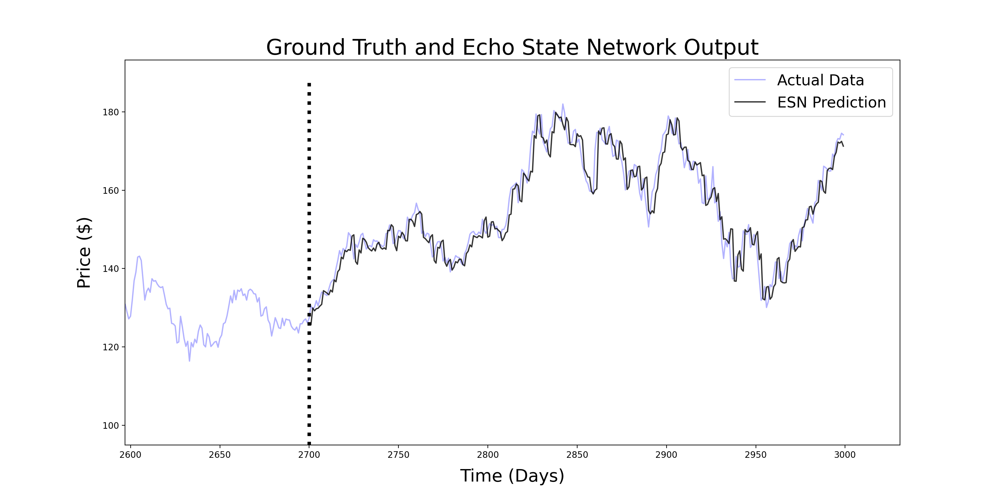

# StockESN

The ability of the echo state network to analyse chaotic time series makes it an interesting tool for financial forecasting where the data is highly nonlinear and chaotic.

In an echo state network, we only have to train the output weights of the network, and it speeds up the training of the neural network, generally provides better predictions. ESN training, by contrast to other methods, is fast, does not suffer from bifurcations, and is easy to implement. On a number of benchmark tasks, ESNs have greatly outperformed all other methods of nonlinear dynamical modeling.

### ESN-NN Prediction of APPLE stock price
Here we predict two days ahead by using the previous 2700 points and do that for 300 future points. 

